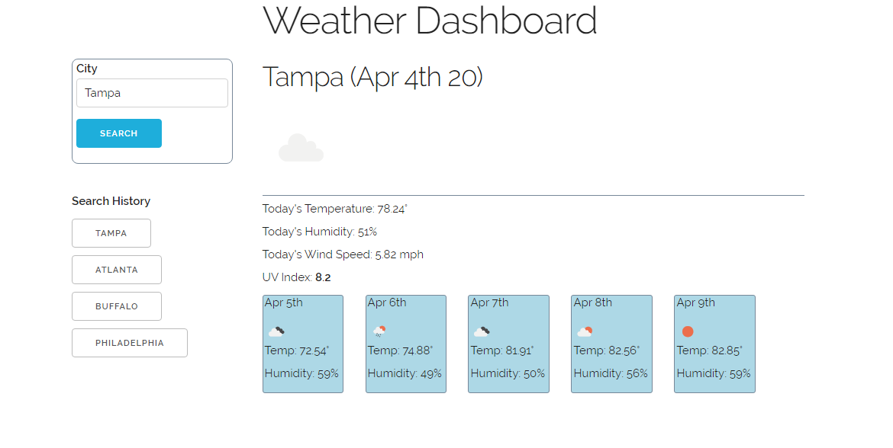

WEATHER DASHBOARD

1. Overview

Weather Dashboard shows current and future weather conditions in a city according to the user's search. The dashboard saves the last-searched city for convenience upon next use. The dashboard also keeps a list of previously searched cities during that browser session. Metrics shown include temperature, humidity, wind speed and UV index, including a five-day forecast.

2. Functionality

Weather Dashboard runs using jQuery, moment.js, and Open Weather API. The application uses local storage to keep the last-searched city available.

3. Screenshots

4. Credits and Links

Made by Dan McKeon.

Active webpage: https://dooski.github.io/weather-dashboard/
GitHub repository: https://github.com/dooski/weather-dashboard